  
[REPO LINK](!https://github.com/katharsis23/AI-documentation-helper.git)
# General

  

Intelligent Assistant for Technical Documentation — an **AI tool designed to help you with your boring documentation.** Feed it your Markdown/PDF docs and ask questions in natural language; it answers using a **Retrieval-Augmented Generation (RAG)** pipeline and cites the exact sources (file + section/page) it relied on.

  

The system does not train a model from scratch — it orchestrates an existing LLM/embedding model around a custom RAG architecture: parse → chunk → embed → store → retrieve → generate.

  

## Prerequisites

  

### Language & tooling

- **Python 3.13** (`>=3.13, <=3.14`)

- **Poetry** — dependency management and virtual environments (see [Install and Usage](#install-and-usage))

- *(NIX SUPPORT)* **[Nix](https://nixos.org/)** — a reproducible dev shell is provided (`shell.nix`)
- Any other Linux distro. You may try it on other platforms but i cant guarantee it would work

  

### AI provider (generation)

One of the following must be reachable:

- **Ollama** server (local models, e.g. Llama 3.1 / Qwen2.5), **or**

- **DeepSeek API key** (cloud, OpenAI-compatible API)

  

### Embedding provider (retrieval)

Embeddings are configured **independently** from the chat provider — generation and embeddings routinely use different models/servers:

- **Ollama** serving an embedding model (recommended: **`bge-m3`**, 1024-dim), **or**

- any OpenAI-compatible embedding endpoint

  >!IMPORTANT
>Please, look at the supported models [Supported Devices]
> A chat model cannot produce embeddings, so `embedding_provider` must always point to a model that actually supports the embeddings API.

  

### Data store

- **SQLite** with the **`sqlite-vec`** extension (bundled as a Python wheel — no manual install needed)

  

## Supported Providers

  

Providers are selected through configuration in [`src/documentation_helper/config/config.py`](src/documentation_helper/config/config.py) and wired together in factories. The current support matrix:

  

| Layer | Supported values | Notes |

|---|---|---|

| **AI (generation)** | `ollama`, `deepseek` | Selectable via `ai_provider` |

| **Embeddings** | `ollama`, `deepseek` | Selectable via `embedding_provider` (independent of `ai_provider`) |

| **Vector store / DB** | `sqlite` (`sqlite-vec`) | Selectable via `db_provider` |

  

> This list is intentionally easy to extend. Every layer is defined by a small **Protocol** (`ILLMRequest`, `IEmbeddingProvider`, `IVectorStorage`, `IDocumentParser`, `IChunker`), and concrete implementations are resolved by a factory:
> - LLM / embeddings — [`llm/llm_factory.py`](src/documentation_helper/llm/llm_factory.py)
> - DB backend — `StorageManager._PROVIDERS` in [`storage/storage_manager.py`](src/documentation_helper/storage/storage_manager.py)
> - Parsers — [`parsers/parser_factory.py`](src/documentation_helper/parsers/parser_factory.py)
> **Contributions and third-party plugins are welcome.** To add a new provider you implement the matching Protocol and register the class in the corresponding factory — no changes to `RAGPipeline` are required. Feel free to open a PR with a new backend (e.g. Qdrant/pgvector, a new cloud LLM, or another embedding model).

  

---

  

## Install and Usage

  

### 1. Clone the repository

  

```bash

git clone <repo-url>

cd documentation-helper

```

  

### 2. Configure environment

  

Copy the example env file and fill in the values you need:

  

```bash

cp .env.example .env

```

  

Key variables (all optional unless the selected provider requires them):

  

```dotenv

# Which provider generates answers: ollama | deepseek

AI_PROVIDER=ollama

  

# --- Ollama ---

OLLAMA_URL=http://localhost:11434

OLLAMA_MODEL=llama3.1

  

# --- DeepSeek (cloud) ---

DEEPSEEK_URL=https://api.deepseek.com

DEEPSEEK_API_KEY=your_key_here

DEEPSEEK_MODEL=deepseek-chat

  

# --- Embeddings (independent from generation) ---

EMBEDDING_PROVIDER=ollama

EMBEDDING_MODEL=bge-m3

EMBEDDING_DIM=1024

  

# --- Storage ---

DB_PROVIDER=sqlite

DB_PATH=./data/vector_store.db

UPLOADS_DIR=./data/uploads

```

  

> `EMBEDDING_DIM` **must** match the embedding model (e.g. `bge-m3` → 1024, `all-MiniLM-L6-v2` → 384). The vector table is fixed at creation, so changing this requires re-indexing.

  

### 3. Install dependencies

  

```bash

poetry install

```

  

### 4. Start the model server

  

- **Ollama (local):** make sure the server is running and the models are pulled:

  

```bash

ollama serve

ollama pull bge-m3 # embeddings

ollama pull llama3.1 # generation

```

  

- **DeepSeek (cloud):** just export your key (or put it in `.env`):

  

```bash

export DEEPSEEK_API_KEY="your_key"

```

  

### 5. Run the API

  

```bash

poetry run uvicorn src.documentation_helper.main:app --reload

```

  

The server starts at `http://127.0.0.1:8000`. Interactive API docs are at `/docs`.

  

### 6. Use it

  

```bash

# Upload & index a document

curl -F "file=@./python_docs_test.md" http://127.0.0.1:8000/documents

  

# List indexed documents

curl http://127.0.0.1:8000/documents

  

# Ask a question

curl -X POST http://127.0.0.1:8000/query \

-H "Content-Type: application/json" \

-d '{"question": "How do I create a Deployment in Kubernetes?", "top_k": 5}'

  

# Delete a document (and its chunks)

curl -X DELETE http://127.0.0.1:8000/documents/<doc_id>

```

  

### Development tasks

  

Common workflows are wrapped with [Invoke](https://www.pyinvoke.org/) (`tasks.py`):

  

```bash

poetry run invoke check # ruff lint + format check

poetry run invoke test # run the test suite

poetry run invoke format # apply ruff format + auto-fixes

poetry run invoke ci # check + test (what CI runs)

```

  

## Nix support enabled

  

A reproducible development shell is provided via [`shell.nix`](shell.nix) (Python 3.13 + Poetry), so you don't have to manage the toolchain by hand.

  

**With [Nix](https://nixos.org/download) installed**, just run:

  

```bash

nix-shell

```

  

This drops you into a shell with `python313` and `poetry` available and sets `LD_LIBRARY_PATH` so compiled libraries (e.g. `sqlite-vec`) load correctly. From there, follow steps 2–5 above (`poetry install`, configure `.env`, run the server).

  

> The dev shell is also referenced by CI. If you use [direnv](https://direnv.net/) + [nix-direnv](https://github.com/nix-community/nix-direnv), you can auto-enter it on `cd`.

  

## API endpoints

  

| Method | Path | Description |

|---|---|---|

| `GET` | `/` | Healthcheck |

| `POST` | `/documents` | Upload a file (MD/PDF), trigger indexing |

| `GET` | `/documents` | List uploaded documents |

| `DELETE` | `/documents/{doc_id}` | Delete a document and its chunks |

| `POST` | `/query` | Ask a question, get an answer with source references |

  

### Example `POST /query`

  

**Request:**

  

```json

{

"question": "How do I create a Deployment in Kubernetes?",

"top_k": 5

}

```

  

**Response:**

  

```json

{

"answer": "To create a Deployment, you need to describe a YAML manifest with fields apiVersion, kind: Deployment... [source: k8s-docs.md, section 'Workloads']",

"sources": [

{

"source_file": "k8s-docs.md",

"section_header": "Workloads",

"page_number": 1,

"relevance_score": 0.87

}

]

}

```

  

---

  

## Architecture

  

The codebase is organized into small, single-responsibility modules grouped by layer. Each layer is defined by a **Protocol** (interface) and consumed only through that abstraction.

  

```

src/documentation_helper/

main.py # FastAPI app, DI wiring, endpoints bootstrap

api/router.py # HTTP route handlers (thin controllers)

config/config.py # pydantic-settings Config (env-driven, validated)

protocols/ # interfaces + shared domain models (DTOs)

parsers.py # IDocumentParser, ParsedDocument, Section

chunker.py # IChunker, Chunk, SearchResult

embedding.py # IEmbeddingProvider, IEmbeddingBackend, IBatchEmbeddingBackend

llm.py # ILLMRequest, LLMResponse

storage.py # IVectorStorage

model.py # QueryRequest/Response, DocumentInfo, etc.

parsers/ # parser_factory.py, md_parser.py, pdf_parser.py

chunker/ # md_header_chunker.py, fixed_size_chunker.py

embedding_provider.py # LocalEmbeddingProvider

storage/ # storage_manager.py (facade), sqlite_provider.py (low-level)

llm/ # llm_factory.py, ollama_provider.py, deepseek_provider.py, prompt_builder.py

rag_pipeline.py # RAGPipeline orchestrator

tests/ # unit tests per layer

data/ # uploads/ and vector_store.db

```

  

### Class diagram

```mermaid

classDiagram

%% ==================== CONFIGURATION LAYER ====================

class Config {

+ai_provider: Literal["ollama", "deepseek"]

+ollama_url: HttpUrl

+ollama_model: str

+deepseek_url: HttpUrl

+deepseek_api_key: SecretStr

+embedding_provider: Literal["ollama", "deepseek"]

+embedding_model: str

+embedding_dim: int

+embedding_batch_size: int

+db_provider: str

+db_path: str

+uploads_dir: str

+active_base_url() str

+active_model() str

+active_embedding_model() str

+validate_and_load_provider_config() Config

}

  

%% ==================== API LAYER ====================

class FastAPIApp {

+lifespan() void

+upload_document(file: UploadFile) DocumentUploadResponse

+query(payload: QueryRequest) QueryResponse

+list_documents() List~DocumentInfo~

+delete_document(doc_id: UUID) None

+healthcheck() JSONResponse

}

  

%% ==================== ORCHESTRATION ====================

class RAGPipeline {

-config: Config

-parser_factory: ParserFactory

-chunker: IChunker

-embedding_provider: IEmbeddingProvider

-vector_store: StorageManager

-llm_provider: ILLMRequest

-prompt_builder: PromptBuilder

+ingest_document(file_path, metadata, doc_id) IngestResult

+answer_query(question, top_k, filters) QueryResponse

-_to_source_reference(result) SourceReference

}

  

class PromptBuilder {

+system_prompt: str

-question: str

-chunks: List~Chunk~

-_format_context() str

+build() str

}

  

%% ==================== DOCUMENT PROCESSING ====================

class ParserFactory {

-_PARSERS: dict

+get_parser(file_ext: str) IDocumentParser

}

  

class IDocumentParser {

<<protocol>>

+parse(filepath: str) ParsedDocument

}

  

class MDParser {

+parse(filepath: str) ParsedDocument

-_extract_sections(raw_text) List~Section~

}

  

class PDFParser {

+parse(filepath: str) ParsedDocument

}

  

class ParsedDocument {

+raw_text: str

+source_file: str

+source_metadata: dict

+sections: List~Section~

}

  

class Section {

+heading: str

+text: str

+page_number: int

+level: int

}

  

class IChunker {

<<protocol>>

+split(document: ParsedDocument) List~Chunk~

}

  

class MarkdownHeaderChunker {

-max_chunk_size: int

-overlap: int

+split(document: ParsedDocument) List~Chunk~

-_iter_blocks(raw_text) List~tuple~

-_split_block(text) List~str~

-_create_chunk(text, source_file, header, index) Chunk

}

  

class FixedSizeChunker {

-chunk_size: int

-overlap: int

+split(document) List~Chunk~

}

  

class Chunk {

+chunk_id: UUID

+text: str

+source_file: str

+section_header: str

+page_number: int

+chunk_index: int

+content_hash: str

+tags: dict

+calculate_hash() str

}

  

%% ==================== EMBEDDINGS ====================

class IEmbeddingProvider {

<<protocol>>

+embed(texts: List~str~) List~Vector~

+embed_query(text: str) Vector

}

  

class IEmbeddingBackend {

<<protocol>>

+post_embedding(text: str) Vector

}

  

class IBatchEmbeddingBackend {

<<protocol>>

+post_embeddings(texts: List~str~) List~Vector~

}

  

class LocalEmbeddingProvider {

-model_name: str

-backend: IEmbeddingBackend

+embed(texts: List~str~) List~Vector~

+embed_query(text: str) Vector

}

  

%% ==================== VECTOR STORAGE ====================

class IVectorStorage {

<<protocol>>

+add(chunks, vectors, doc_id) None

+search(query_vector, top_k, filters) List~SearchResult~

+delete_by_document(doc_id) None

+list_documents() List~dict~

}

  

class StorageManager {

-db_provider: str

-db_path: str

-uploads_dir: str

-_db: SQLiteProvider

+get_db() SQLiteProvider

+get_path_to_documents() str

+context_manager() Iterator

+add(chunks, vectors, doc_id, filename) None

+search(query_vector, top_k, filters) List~SearchResult~

+delete_by_document(doc_id) None

+list_documents() List~dict~

+close() None

}

  

class SQLiteProvider {

-db_path: str

-embedding_dim: int

-connection: Connection

+_connect() Connection

+_create_tables() None

+add_document(doc_id, filename, uploaded_at) None

+add_document_chunks(chunks, vectors) None

+search_document(query_vector, top_k, doc_id) List~Row~

+delete_by_document(doc_id) None

+list_documents() List~Row~

+close() None

}

  

class SearchResult {

+chunk: Chunk

+score: float

}

  

%% ==================== LLM ====================

class ILLMRequest {

<<protocol>>

+model: str

+url: str

+api_key: str

+query(prompt: str) LLMResponse

}

  

class OllamaProvider {

-model: str

-url: str

-api_key: str

-embed_batch_size: int

+query(prompt: str) LLMResponse

+post_embedding(text: str) Vector

+post_embeddings(texts: List~str~) List~Vector~

}

  

class DeepSeekProvider {

-model: str

-url: str

-api_key: str

+query(prompt: str) LLMResponse

}

  

class LLMResponse {

+text: str

+raw_response: dict

}

  

class LLMFactory {

<<factory>>

+get_llm_provider(provider_name, url, model, api_key) ILLMRequest

}

  

%% ==================== DTO / API MODELS ====================

class QueryRequest {

+question: str

+top_k: int

+filters: dict

}

  

class QueryResponse {

+answer: str

+sources: List~SourceReference~

}

  

class SourceReference {

+source_file: str

+section_header: str

+page_number: int

+relevance_score: float

}

  

class DocumentUploadResponse {

+doc_id: UUID

+status: str

+chunks_created: int

}

  

class DocumentInfo {

+doc_id: UUID

+filename: str

+uploaded_at: datetime

+chunk_count: int

}

  

class IngestResult {

+doc_id: UUID

+chunks_created: int

}

  

%% ==================== RELATIONSHIPS ====================

FastAPIApp --> Config : uses

RAGPipeline --> Config : uses

FastAPIApp --> RAGPipeline : uses

FastAPIApp --> StorageManager : uses

  

RAGPipeline --> ParserFactory

RAGPipeline --> IChunker

RAGPipeline --> IEmbeddingProvider

RAGPipeline --> IVectorStorage : via StorageManager

RAGPipeline --> ILLMRequest

RAGPipeline --> PromptBuilder

  

ParserFactory --> IDocumentParser : creates

IDocumentParser <|.. MDParser : implements

IDocumentParser <|.. PDFParser : implements

IDocumentParser --> ParsedDocument : returns

ParsedDocument o-- Section

  

IChunker <|.. MarkdownHeaderChunker : implements

IChunker <|.. FixedSizeChunker : implements

IChunker --> ParsedDocument : processes

IChunker --> Chunk : creates

  

IEmbeddingProvider <|.. LocalEmbeddingProvider : implements

LocalEmbeddingProvider --> IEmbeddingBackend : delegates to

IEmbeddingBackend <|.. IBatchEmbeddingBackend : optional extension

  

IVectorStorage <|.. StorageManager : implements (facade)

StorageManager --> SQLiteProvider : delegates to

StorageManager --> SearchResult : returns

SearchResult --> Chunk

  

ILLMRequest <|.. OllamaProvider : implements

ILLMRequest <|.. DeepSeekProvider : implements

LLMFactory ..> ILLMRequest : creates

ILLMRequest --> LLMResponse : returns

OllamaProvider ..> IEmbeddingBackend : also provides

  

RAGPipeline --> QueryResponse : builds

RAGPipeline --> IngestResult : builds

QueryResponse o-- SourceReference

  

FastAPIApp --> QueryRequest

FastAPIApp --> DocumentUploadResponse

FastAPIApp --> DocumentInfo

```

  



  

### Module contracts

  

- **`IDocumentParser.parse()`** — turns a file (MD/PDF) into a structured `ParsedDocument` split into `Section`s by heading/page, preserving the metadata needed for citations. `MDParser` splits on `#`…`######`; `PDFParser` extracts text page by page.

- **`IChunker.split()`** — turns a `ParsedDocument` into size-bounded `Chunk`s (`~1000` chars, `~100` overlap). `MarkdownHeaderChunker` keeps paragraphs within a heading; `FixedSizeChunker` is a fallback. Every chunk carries `source_file`, `section_header`, `page_number`, `chunk_index`, and a `content_hash`.

- **`IEmbeddingProvider`** — `embed()` for batch ingestion, `embed_query()` for a single query (may apply model-specific preprocessing). Implemented by `LocalEmbeddingProvider`, which delegates to an injected backend and transparently uses batch embedding when available.

- **`IVectorStorage`** — `add()`, `search(top_k, filters)`, `delete_by_document()`, `list_documents()`. Implemented by `StorageManager` (facade) over `SQLiteProvider` (`sqlite-vec`).

- **`ILLMRequest.query()`** — one method hiding the difference between local (Ollama) and cloud (DeepSeek). Neither `RAGPipeline` nor `PromptBuilder` know which is in use.

- **`PromptBuilder`** — keeps the system prompt in a separate constant and assembles `system instruction + numbered context + question`.

- **`RAGPipeline`** — the orchestrator: `ingest_document()` (parse → chunk → embed → store) and `answer_query()` (embed query → search → build prompt → generate → map to `QueryResponse`).

  

---

  

## Why this architecture? (patterns & design decisions)

  

The goal was a **modular, testable, and extensible** RAG system where each layer can be swapped or scaled independently. Concretely this meant applying a set of well-known design patterns and principles.

  

### SOLID

  

- **Single Responsibility** — every class has one job: `MDParser` parses, `MarkdownHeaderChunker` chunks, `LocalEmbeddingProvider` embeds, `SQLiteProvider` talks SQL, `RAGPipeline` orchestrates, `api/router.py` handles HTTP. The low-level `SQLiteProvider` knows nothing about domain models; `StorageManager` knows nothing about SQL drivers.

- **Open/Closed** — new providers are added by *extending* (new class + factory registration), never by editing the pipeline. Adding Qdrant or a new LLM touches one file, not the core.

- **Liskov Substitution** — any `ILLMRequest` implementation (`OllamaProvider`, `DeepSeekProvider`) can be dropped into the pipeline interchangeably; the caller relies only on the contract.

- **Interface Segregation** — small, focused protocols instead of one fat interface: `IEmbeddingBackend` (single text) is separate from the optional `IBatchEmbeddingBackend` (batch). A backend only implements what it can support, and `LocalEmbeddingProvider` detects batch support at runtime.

- **Dependency Inversion** — high-level modules (`RAGPipeline`) depend on **abstractions** (`Protocol`s), not concrete classes. Concrete implementations are injected from the outside (`main.py`).

  

### Structural & creational patterns

  

- **Factory** — `ParserFactory` (by extension) and `get_llm_provider()` (by provider name) centralize object creation and keep `if/else` provider-switching out of the domain logic. `StorageManager._PROVIDERS` maps a config value to a backend class.

- **Facade** — `StorageManager` is the single, simple entry point the rest of the app uses for persistence. It hides the raw-SQL `SQLiteProvider`, the connection/context management, domain↔row mapping, and the uploads directory behind four domain-level methods.

- **Protocol / Adapter** — `typing.Protocol` gives structural (interface) typing without inheritance coupling, so third-party classes satisfy a contract as long as they have the right methods. Providers are effectively adapters wrapping the Ollama/DeepSeek HTTP APIs behind a uniform `query()`.

- **Dependency Injection (manual, framework-free)** — `main.py`'s `lifespan` builds the singletons and wires them into `RAGPipeline` and `app.state`, so no module reaches out for globals (except the read-only `config`) and every dependency is explicit and replaceable — which is exactly what makes the unit tests trivial (inject fakes/stubs).

- **DTO (Data Transfer Objects)** — the Pydantic models in `protocols/model.py` (`QueryRequest`, `QueryResponse`, `DocumentUploadResponse`, `DocumentInfo`) and the domain models (`Chunk`, `ParsedDocument`, `Section`, `SearchResult`, `LLMResponse`) move data between layers with validation and serialization built in. They keep the HTTP boundary, the domain, and the persistence layer decoupled.

  

### Other decisions

  

- **`config` via `pydantic-settings`** — one validated `Config` object reads from env/`.env`. `field_validator`/`model_validator` fail fast with helpful errors (missing keys/URLs), and `SecretStr` keeps API keys out of logs and reprs. `Literal[...]` types make the supported provider set explicit and self-documenting.

- **Async end-to-end** — handlers, providers, and the pipeline are `async`, so I/O (HTTP to Ollama/DeepSeek) doesn't block the event loop; `httpx.AsyncClient` is used throughout.

- **Independent embedding config** — `embedding_provider` is deliberately separate from `ai_provider`, because the common real-world setup is *chat on the cloud + embeddings locally*, and a chat model can't produce embeddings.

- **Singleton lifecycle via FastAPI `lifespan`** — the vector store and pipeline are created once at startup and stored on `app.state`, avoiding global mutable state and ensuring a clean shutdown (`storage.close()`).

- **Course-project minimalism** — no message queue, reranking, or embedding cache in v1. The interfaces leave room for them (see future work) without a rewrite.

  

Together these choices mean the system can be reasoned about, tested, and extended layer by layer — and each decision maps cleanly onto a pattern worth explaining in an interview.

  

---

  

## Quality & testing

  

Tests live in [`tests/`](tests) (one file per layer) and run with pytest (`asyncio_mode = "auto"`). CI (`.github/workflows/ci.yml`) enforces lint/format (Ruff) and the test suite on Python 3.13.

  

A minimal quality plan for evaluation uses a small set of questions with expected sources (a simplified **Recall@k**): does the expected source file/section appear in the top-k results, plus a manual assessment of answer quality.

  

---

  

## Future work

  

- Support additional vector stores (Qdrant, pgvector) through the existing `IVectorStorage` interface, with a performance comparison.

- Rerank retrieved fragments with a cross-encoder before generation.

- Cache embeddings by `content_hash` and cache answers to identical queries.

- Split ingestion and query handling into separate network services for horizontal scaling.

- Complete the `PDFParser` implementation and the `FixedSizeChunker` fallback.

- Fine-tune (LoRA) a local model on a corpus of technical documentation.