# Intelligent Assistant for Technical Documentation (RAG + LLM)


This document is intended to be handed to AI coding agents (e.g. Claude Code) as a technical specification for implementation. It contains the overall idea, architecture, a class diagram, and the contracts between modules.

---

## 1. Overview

The system answers user questions about technical documentation (e.g. Python or Kubernetes docs) using a **Retrieval-Augmented Generation (RAG)** approach:

1. Documents (Markdown, PDF) are uploaded, split into fragments (chunks), and turned into vector embeddings.
2. Embeddings are stored in a vector database (`sqlite-vec`).
3. On a user query, the system retrieves the most relevant fragments by vector similarity.
4. The retrieved fragments are passed into a prompt for a large language model (LLM), which produces an answer with references to the source (file, section/page).

The goal of the course project is not to train an LLM from scratch, but to build a **custom RAG system** (architecture, pipeline, orchestration) around an existing open-source or cloud model. This is what "own AI" means in the context of the assignment.

### Key architectural principles

- **Clean interfaces (Protocol/ABC)** between layers — parser, chunker, vector store, embedding provider, LLM provider. This allows implementations to be swapped without rewriting the rest of the code.
- **Local run, with room to scale** — everything runs inside a single FastAPI application, but modules are logically independent and can be split into separate services later.
- **Minimalism appropriate for a course project scope** — no message queues, no reranking, no embedding caching in the first version (move these to a "future work" section).

---

## 2. Technology stack

| Component | Technology |
|---|---|
| Web framework / API | FastAPI |
| Vector store | sqlite-vec |
| PDF parsing | pymupdf (fitz) |
| Markdown parsing | standard parser (markdown-it-py / regex over headings) |
| Embeddings | local model (e.g. `sentence-transformers/all-MiniLM-L6-v2` or `bge-small`) |
| LLM generation | local model via Ollama (Llama 3.1 / Qwen2.5) or a cloud OpenAI-compatible API |
| Implementation language | Python 3.13+ |

---

## 3. Class diagram (Mermaid)

The following diagram shows the ideal architecture we're moving forward to

```mermaid
classDiagram
    %% ==================== CONFIGURATION LAYER ====================
    class Config {
        +ai_provider: Literal["ollama", "deepseek"]
        +ollama_url: Optional~HttpUrl~
        +deepseek_url: Optional~HttpUrl~
        +deepseek_api_key: Optional~SecretStr~
        +validate_provider_urls_and_keys() Config
        +load_api_key_strictly_from_os() Config
    }

    %% ==================== API LAYER ====================
    class FastAPIApp {
        -config: Config
        +upload_document(file: UploadFile) DocumentUploadResponse
        +query(request: QueryRequest) QueryResponse
        +list_documents() List~DocumentInfo~
        +delete_document(doc_id: str) None
    }

    %% ==================== ORCHESTRATION ====================
    class RAGPipeline {
        -config: Config
        -parser_factory: ParserFactory
        -chunker: Chunker
        -embedding_provider: EmbeddingProvider
        -vector_store: VectorStore
        -llm_provider: LLMProvider
        -prompt_builder: PromptBuilder
        +ingest_document(file_path: str, metadata: dict) IngestResult
        +answer_query(question: str, top_k: int) QueryResponse
    }

    class PromptBuilder {
        -system_template: str
        +build(question: str, chunks: List~Chunk~) str
    }

    %% ==================== DOCUMENT PROCESSING ====================
    class ParserFactory {
        +get_parser(file_extension: str) DocumentParser
    }

    class DocumentParser {
        <<interface>>
        +parse(file_path: str) ParsedDocument
    }

    class MarkdownParser {
        +parse(file_path: str) ParsedDocument
    }

    class PDFParser {
        +parse(file_path: str) ParsedDocument
    }

    class ParsedDocument {
        +raw_text: str
        +sections: List~Section~
        +source_metadata: dict
    }

    class Section {
        +heading: str
        +text: str
        +page_number: int
        +level: int
    }

    class Chunker {
        <<interface>>
        +split(document: ParsedDocument) List~Chunk~
    }

    class MarkdownHeaderChunker {
        -max_chunk_size: int
        -overlap: int
        +split(document: ParsedDocument) List~Chunk~
    }

    class FixedSizeChunker {
        -chunk_size: int
        -overlap: int
        +split(document: ParsedDocument) List~Chunk~
    }

    class Chunk {
        +chunk_id: str
        +text: str
        +source_file: str
        +section_heading: str
        +page_number: int
        +chunk_index: int
        +content_hash: str
        +tags: dict
    }

    %% ==================== EMBEDDINGS ====================
    class EmbeddingProvider {
        <<interface>>
        +embed(texts: List~str~) List~Vector~
        +embed_query(text: str) Vector
    }

    class LocalEmbeddingProvider {
        -model_name: str
        -model: object
        +embed(texts: List~str~) List~Vector~
        +embed_query(text: str) Vector
    }

    %% ==================== VECTOR STORAGE ====================
    class VectorStore {
        <<interface>>
        +add(chunks: List~Chunk~, vectors: List~Vector~) None
        +search(query_vector: Vector, top_k: int, filters: dict) List~SearchResult~
        +delete_by_document(doc_id: str) None
        +list_documents() List~DocumentInfo~
    }

    class SQLiteVecStore {
        -db_path: str
        -connection: object
        +add(chunks: List~Chunk~, vectors: List~Vector~) None
        +search(query_vector: Vector, top_k: int, filters: dict) List~SearchResult~
        +delete_by_document(doc_id: str) None
        +list_documents() List~DocumentInfo~
        -_init_schema() None
    }

    class SearchResult {
        +chunk: Chunk
        +score: float
    }

    %% ==================== LLM ====================
    class LLMProvider {
        <<interface>>
        +generate(prompt: str) LLMResponse
    }

    class OllamaProvider {
        -model_name: str
        -base_url: str
        +generate(prompt: str) LLMResponse
    }

    class CloudAPIProvider {
        -api_key: str
        -model_name: str
        +generate(prompt: str) LLMResponse
    }

    class LLMResponse {
        +text: str
        +raw_response: dict
    }

    %% ==================== DTO / API MODELS ====================
    class QueryRequest {
        +question: str
        +top_k: int
        +filters: dict
    }

    class QueryResponse {
        +answer: str
        +sources: List~SourceReference~
    }

    class SourceReference {
        +source_file: str
        +section_heading: str
        +page_number: int
        +relevance_score: float
    }

    class DocumentUploadResponse {
        +doc_id: str
        +status: str
        +chunks_created: int
    }

    class DocumentInfo {
        +doc_id: str
        +filename: str
        +uploaded_at: datetime
        +chunk_count: int
    }

    class IngestResult {
        +doc_id: str
        +chunks_created: int
    }

    %% ==================== RELATIONSHIPS ====================
    FastAPIApp --> Config : uses
    RAGPipeline --> Config : uses
    Config ..> LLMProvider : configures

    FastAPIApp --> RAGPipeline : uses

    RAGPipeline --> ParserFactory
    RAGPipeline --> Chunker
    RAGPipeline --> EmbeddingProvider
    RAGPipeline --> VectorStore
    RAGPipeline --> LLMProvider
    RAGPipeline --> PromptBuilder

    ParserFactory --> DocumentParser : creates
    DocumentParser <|.. MarkdownParser : implements
    DocumentParser <|.. PDFParser : implements
    DocumentParser --> ParsedDocument : returns
    ParsedDocument o-- Section

    Chunker <|.. MarkdownHeaderChunker : implements
    Chunker <|.. FixedSizeChunker : implements
    Chunker --> ParsedDocument : processes
    Chunker --> Chunk : creates

    EmbeddingProvider <|.. LocalEmbeddingProvider : implements

    VectorStore <|.. SQLiteVecStore : implements
    VectorStore --> SearchResult : returns
    SearchResult --> Chunk

    LLMProvider <|.. OllamaProvider : implements
    LLMProvider <|.. CloudAPIProvider : implements
    LLMProvider --> LLMResponse : returns

    RAGPipeline --> QueryResponse : builds
    RAGPipeline --> IngestResult : builds
    QueryResponse o-- SourceReference

    FastAPIApp --> QueryRequest
    FastAPIApp --> DocumentUploadResponse
    FastAPIApp --> DocumentInfo
```



---

## 4. Module contracts

### 4.1 `DocumentParser` (interface)

Responsible for turning a file (MD/PDF) into a structured intermediate form (`ParsedDocument`), split into sections by headings/pages, without losing the metadata needed for later source citation.

- `MarkdownParser` — splits text by `#`, `##`, `###` headings.
- `PDFParser` (based on `pymupdf`) — extracts text page by page, storing the page number in each `Section`.

### 4.2 `Chunker` (interface)

Takes a `ParsedDocument` and returns a list of `Chunk` objects with a bounded size (~500–800 tokens) and overlap (~50–100 tokens), so context is not lost across chunk boundaries.

- `MarkdownHeaderChunker` — avoids splitting a paragraph across a heading boundary where possible.
- `FixedSizeChunker` — fallback for arbitrary text.

Every `Chunk` must carry `source_file`, `section_heading`, `page_number`, `chunk_index`, `content_hash` — this is the basis for building source references in the final answer.

### 4.3 `EmbeddingProvider` (interface)

Converts text into a vector. `embed()` is used for batch processing chunks during ingestion; `embed_query()` is a separate method for a single user query (it may apply different preprocessing/prefixing depending on the model).

### 4.4 `VectorStore` (interface)

- `add()` — stores chunks together with their vectors and metadata.
- `search()` — top-k vector search with optional filtering by `tags`/`source_file`.
- `delete_by_document()` — removes all chunks of a document (for re-indexing or deletion).
- `list_documents()` — used by the endpoint that lists uploaded documents.

`SQLiteVecStore` is the only implementation for the course project, but the interface allows adding `QdrantStore`, `PgVectorStore`, etc. later without changing `RAGPipeline`.

### 4.5 `LLMProvider` (interface)

`generate(prompt: str) -> LLMResponse` — a single method that hides the difference between a local model (Ollama) and a cloud API. Neither `RAGPipeline` nor `PromptBuilder` need to know which implementation is in use.

### 4.6 `PromptBuilder`

Builds the final prompt: a system instruction (answer only based on the provided context, cite sources in the form `[source: file, section/page]`) + numbered context fragments + the user's question.

### 4.7 `RAGPipeline` — orchestrator

- `ingest_document()`: parser → chunker → embedding_provider → vector_store.
- `answer_query()`: embedding_provider.embed_query() → vector_store.search() → prompt_builder.build() → llm_provider.generate() → builds `QueryResponse` by mapping `SearchResult` → `SourceReference`.

---

## 5. Project structure

```
app/
  main.py              # FastAPI application, endpoints
  models/
    api_models.py       # QueryRequest, QueryResponse, DocumentUploadResponse, etc.
    domain.py            # Chunk, ParsedDocument, Section, SearchResult
  parsing/
    base.py               # DocumentParser interface
    markdown_parser.py
    pdf_parser.py
    factory.py            # ParserFactory
  chunking/
    base.py               # Chunker interface
    markdown_chunker.py
    fixed_size_chunker.py
  embeddings/
    base.py               # EmbeddingProvider interface
    local_provider.py
  storage/
    base.py               # VectorStore interface
    sqlite_vec_store.py
  llm/
    base.py               # LLMProvider interface
    ollama_provider.py
    cloud_provider.py
  rag/
    pipeline.py            # RAGPipeline
    prompt_builder.py
  config.py               # settings (paths, embedding model, LLM URL)
tests/
  ...
data/
  uploads/                # original uploaded files
  vector_store.db          # sqlite-vec database
```

---

## 6. API endpoints

| Method | Path | Description |
|---|---|---|
| `POST` | `/documents` | Upload a file (MD/PDF), trigger indexing |
| `GET` | `/documents` | List uploaded documents |
| `DELETE` | `/documents/{doc_id}` | Delete a document and its chunks |
| `POST` | `/query` | Ask a question, get an answer with source references |

### Example `POST /query`

**Request:**
```json
{
  "question": "How do I create a Deployment in Kubernetes?",
  "top_k": 5
}
```

**Response:**
```json
{
  "answer": "To create a Deployment, you need to describe a YAML manifest with fields apiVersion, kind: Deployment... [source: k8s-docs.md, section 'Workloads']",
  "sources": [
    {
      "source_file": "k8s-docs.md",
      "section_heading": "Workloads",
      "page_number": null,
      "relevance_score": 0.87
    }
  ]
}
```

---

## 7. Minimal quality-testing plan

For a course project a small set (10–15 questions) with expected sources is enough:

```json
[
  {
    "question": "...",
    "expected_source_file": "python-docs.md",
    "expected_section": "..."
  }
]
```

Metric: whether the expected source appears in the top-k search results (a simplified Recall@k), plus a manual assessment of answer quality.

---

## 8. Future work (for the "Conclusions" section)

- Support for multiple vector stores (Qdrant, pgvector) through the existing `VectorStore` interface, with a performance comparison.
- Reranking retrieved fragments with a cross-encoder before generation.
- Caching embeddings by `content_hash` and caching answers to identical queries.
- Splitting ingestion and query-handling into separate network services for horizontal scaling.
- Fine-tuning (LoRA) a local model on a corpus of technical documentation.

---

## 9. Instructions for the implementing AI agent

1. Implement modules in this order: `models` → `parsing` → `chunking` → `embeddings` → `storage` → `llm` → `rag` → `main.py` (API).
2. Implement every interface (`*.base.py`) using `abc.ABC` or `typing.Protocol` — concrete classes are wired up through a simple factory/DI in `main.py` or `config.py`, without a DI framework.
3. Keep all text prompts (system prompt, source-citation template) in separate constants/files rather than hardcoded in the logic, for easy editing.
4. Follow the method contracts listed in Section 4 exactly — do not change signatures without need, since `RAGPipeline` depends on these precise interfaces.
5. For local setup — provide a `README.md` with instructions: start Ollama, set the model in `config.py`, set the path to the sqlite-vec database.